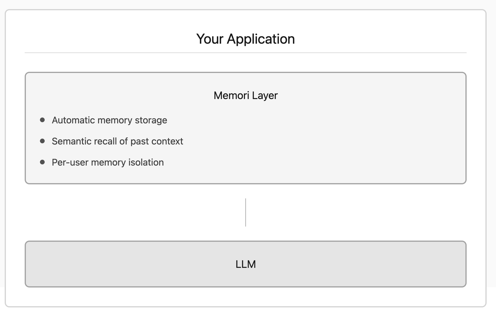

# Building a Finance Agent with Memori

Spin up a financial assistant that remembers your conversations across sessions.

You can create a personalized AI finance agent using Memori. This guide walks you through how memory was added to this project and how it works.

Try the live demo: [finance-agent-web-six.vercel.app](https://finance-agent-web-six.vercel.app)

## Architecture Overview



## Demo

Here's the finance agent in action, demonstrating how memory persists across conversations:

<video src="./memori.mp4" controls width="100%"></video>

## What Memori Does

Memori adds persistent memory to your AI agents. When users share financial information, the agent remembers it for future conversations without you writing any storage logic.

**First conversation:**
```
You: "I make $5,000 per month"
Agent: "Great! With a $5,000 monthly income, a 50/30/20 budget would allocate
        $2,500 for needs, $1,500 for wants, and $1,000 for savings..."
```

**Later conversation (minutes, hours, or days later):**
```
You: "What should my rent budget be?"
Agent: "Based on your $5,000 monthly income, I'd recommend keeping rent
        under $1,250 to stay within the 25% housing guideline..."
```

The agent remembered the income without the user repeating it. Memori handles storage, retrieval, and context injection automatically.

---

## Step-by-Step: Adding Memori to This Project

### Step 1: Install Dependencies

Add Memori and the PostgreSQL driver to your project:

**`pyproject.toml`**
```toml
[project]
dependencies = [
    "memori>=3.1.5",
    "psycopg2-binary>=2.9.11",
    # ... other dependencies
]
```

Install with:
```bash
uv sync
```

### Step 2: Create the Database Connection Factory

Memori needs a function that returns a database connection. Create a session factory:

**`app/db/session.py`**
```python
import os
from dotenv import load_dotenv
import psycopg2

load_dotenv()

def db_session_factory():
    return psycopg2.connect(os.getenv("DATABASE_URL"))
```

This function is called by Memori whenever it needs to interact with the database.

### Step 3: Create the Memory Wrapper

Create a helper function that wraps your OpenAI client with Memori:

**`app/memory/memori.py`**
```python
from memori import Memori
from app.db.session import db_session_factory

def get_memori(client, user_id: str):
    mem = Memori(conn=db_session_factory).llm.register(client)
    mem.attribution(
        entity_id=user_id,
        process_id="personal_finance_agent"
    )
    return mem
```

**What each part does:**

- `Memori(conn=db_session_factory)` - Creates a Memori instance using your PostgreSQL connection
- `.llm.register(client)` - Wraps the OpenAI client to intercept API calls
- `entity_id=user_id` - Isolates memories per user (no cross-user contamination)
- `process_id="personal_finance_agent"` - Identifies which agent created the memory (useful for multi-agent systems)

### Step 4: Initialize Memory Tables on Startup

Tell Memori to create its database tables when your app starts:

**`app/main.py`**
```python
from contextlib import asynccontextmanager
from fastapi import FastAPI
from memori import Memori
from app.db.session import db_session_factory
from app.db.init import init_database

@asynccontextmanager
async def lifespan(app: FastAPI):
    # Initialize your application tables
    init_database()
    # Initialize Memori tables (memori_*)
    Memori(conn=db_session_factory).config.storage.build()
    yield

app = FastAPI(lifespan=lifespan)
```

`config.storage.build()` creates the necessary `memori_*` tables in your PostgreSQL database on first run.

### Step 5: Use Memory in Your Chat Endpoint

Wrap your OpenAI client with Memori before making API calls:

**`app/api/chat.py`**
```python
from fastapi import APIRouter
from fastapi.responses import StreamingResponse
from memori import Memori
from app.infra.openai_client import get_openai_client
from app.db.session import db_session_factory

router = APIRouter()

@router.post("/chat")
async def chat(payload: ChatRequest):
    client = get_openai_client(payload.openai_api_key)

    # Wrap the client with Memori
    memori = Memori(conn=db_session_factory).llm.register(client)
    memori.attribution(
        entity_id=payload.user_id,
        process_id="personal_finance_agent"
    )

    # Now use the client normally - Memori handles memory automatically
    async def stream():
        response = client.chat.completions.create(
            model="gpt-4.1-mini",
            stream=True,
            messages=[
                {"role": "system", "content": system_prompt},
                {"role": "user", "content": payload.message}
            ],
            tools=FINANCE_TOOLS,
            tool_choice="auto"
        )

        for chunk in response:
            # ... stream handling logic
            yield content

    return StreamingResponse(stream(), media_type="text/plain")
```

**What happens automatically:**

1. Before the API call, Memori queries relevant memories from PostgreSQL
2. Memori injects retrieved memories into the system prompt
3. The request goes to OpenAI with the enriched context
4. Memori extracts new insights from the response and stores them

### Step 6: Add Memory to Background Processing (Optional)

If you process data asynchronously (like transaction ingestion), wrap those clients too:

**`app/api/transactions.py`**
```python
import asyncio
from app.memory.memori import get_memori
from app.infra.openai_client import get_openai_client

def _process_transaction(client, tx):
    """Process a single transaction with OpenAI (blocking)."""
    client.chat.completions.create(
        model="gpt-4.1-mini",
        messages=[
            {
                "role": "system",
                "content": (
                    "You are ingesting verified financial transaction data. "
                    "Extract long-term financial facts conservatively."
                )
            },
            {
                "role": "user",
                "content": (
                    f"On {tx.date}, the user spent ${tx.amount} "
                    f"at {tx.merchant} categorized as {tx.category}."
                )
            }
        ]
    )

@router.post("/transactions")
async def ingest_transactions(payload: TransactionsRequest):
    client = get_openai_client(payload.openai_api_key)

    # Register memory for this user
    await asyncio.to_thread(get_memori, client, payload.user_id)

    for tx in payload.transactions:
        # Store transaction in database
        tx_id = await asyncio.to_thread(store_transaction, payload.user_id, tx)

        # Process with LLM for memory extraction (background)
        asyncio.create_task(asyncio.to_thread(_process_transaction, client, tx))

    return {"status": "ok", "ingested": len(payload.transactions)}
```

This extracts financial facts from transactions and stores them as long-term memories.

### Step 7: Use Memory with LangGraph Workflows (Optional)

If you use LangGraph for multi-step workflows, integrate Memori in each node that calls the LLM:

**`app/langgraph/state.py`**
```python
from typing import TypedDict, List

class FinanceState(TypedDict):
    user_id: str
    messages: List[dict]
    insights: List[str]
```

**`app/langgraph/nodes.py`**
```python
from app.memory.memori import get_memori
from app.infra.openai_client import get_openai_client

def recall_node(state: dict):
    return state

def analyze_node(state: dict):
    client = get_openai_client(None)
    get_memori(client, state["user_id"])

    response = client.chat.completions.create(
        model="gpt-4.1-mini",
        messages=state["messages"]
    )

    state["insights"] = [response.choices[0].message.content]
    return state

def persist_node(state: dict):
    client = get_openai_client(None)
    get_memori(client, state["user_id"])

    for insight in state["insights"]:
        client.chat.completions.create(
            model="gpt-4.1-mini",
            messages=[
                {
                    "role": "system",
                    "content": (
                        "Persist high-confidence financial insights "
                        "as long-term memory."
                    )
                },
                {
                    "role": "user",
                    "content": insight
                }
            ]
        )

    return state
```

**`app/langgraph/workflow.py`**
```python
from langgraph.graph import StateGraph, END
from app.langgraph.state import FinanceState
from app.langgraph.nodes import recall_node, analyze_node, persist_node

def build_finance_graph():
    graph = StateGraph(FinanceState)

    graph.add_node("recall", recall_node)
    graph.add_node("analyze", analyze_node)
    graph.add_node("persist", persist_node)

    graph.set_entry_point("recall")
    graph.add_edge("recall", "analyze")
    graph.add_edge("analyze", "persist")
    graph.add_edge("persist", END)

    return graph.compile()
```

---

## How Memory Works Under the Hood

When you wrap a client with `Memori.llm.register(client)`, here's what happens on each API call:

### 1. Memory Recall (Before API Call)
```
User: "What's a good budget for me?"

Memori automatically:
1. Searches for semantically similar memories in PostgreSQL
2. Filters by entity_id (user isolation)
3. Ranks by relevance and recency
4. Injects top memories into the system prompt
```

### 2. Enriched Request
```
The system prompt becomes:
"You are a finance assistant. Previous context:
- User earns $5,000 per month
- User mentioned saving for a house
- User's typical monthly spending is $3,000

User: What's a good budget for me?"
```

### 3. Memory Storage (After API Call)
```
From the response, Memori:
1. Extracts new insights worth remembering
2. Creates vector embeddings for semantic search
3. Stores with entity_id and process_id tags
4. Links to existing related memories
```

---

## Financial Tools in This Agent

This agent includes tools the AI can call to perform calculations:

**`app/api/chat.py`**
```python
FINANCE_TOOLS = [
    {
        "type": "function",
        "function": {
            "name": "calculate_budget",
            "description": "Calculate a recommended budget breakdown based on income using the 50/30/20 rule",
            "parameters": {
                "type": "object",
                "properties": {
                    "monthly_income": {
                        "type": "number",
                        "description": "Monthly income in dollars"
                    }
                },
                "required": ["monthly_income"]
            }
        }
    },
    {
        "type": "function",
        "function": {
            "name": "analyze_spending",
            "description": "Analyze the current user's recent spending and provide insights. No parameters needed - uses the current user's data automatically.",
            "parameters": {
                "type": "object",
                "properties": {},
                "required": []
            }
        }
    },
    {
        "type": "function",
        "function": {
            "name": "set_savings_goal",
            "description": "Help user set a savings goal with a timeline",
            "parameters": {
                "type": "object",
                "properties": {
                    "goal_name": {
                        "type": "string",
                        "description": "Name of the savings goal"
                    },
                    "target_amount": {
                        "type": "number",
                        "description": "Target amount to save in dollars"
                    },
                    "months": {
                        "type": "integer",
                        "description": "Number of months to reach the goal"
                    }
                },
                "required": ["goal_name", "target_amount", "months"]
            }
        }
    }
]
```

The `analyze_spending` tool queries the database for the user's transactions and alerts, which the AI then uses to provide personalized insights.

---

## Running the Project Locally

### Backend Setup

1. Clone the repository:
```bash
git clone https://github.com/daveclinton/financial-advisor-memori.git
cd financial-advisor-memori
```

2. Install backend dependencies:
```bash
cd backend
uv sync
```

3. Create a `.env` file with the required API keys:
```
DATABASE_URL=your_postgres_connection_string
OPENAI_API_KEY=your_openai_api_key
MEMORI_API_KEY=your_memori_api_key
```

**Where to get these keys:**

| Variable | Where to get it |
|----------|-----------------|
| `DATABASE_URL` | Your PostgreSQL provider (Railway, Supabase, Neon, etc.) |
| `OPENAI_API_KEY` | [platform.openai.com/api-keys](https://platform.openai.com/api-keys) |
| `MEMORI_API_KEY` | [memorilabs.ai](https://memorilabs.ai) - Sign up for a free account |

> **Note:** The `OPENAI_API_KEY` is optional if you want users to bring their own keys. The demo allows users to enter their own OpenAI key in the UI.

4. Start the backend:
```bash
uv run uvicorn app.main:app --reload
```

### Frontend Setup

1. Navigate to the web directory:
```bash
cd ../finance-agent-web
pnpm install
```

2. Create `.env.local`:
```
NEXT_PUBLIC_API_URL=http://localhost:8000/api
```

3. Start the frontend:
```bash
pnpm run dev
```

---

## Deployment

### Database (PostgreSQL with pgvector)

Ensure your PostgreSQL instance has the vector extension:
```sql
CREATE EXTENSION IF NOT EXISTS vector;
CREATE EXTENSION IF NOT EXISTS "uuid-ossp";
```

### Backend to Railway

```bash
railway login
railway init
railway variables set DATABASE_URL=your_postgres_url
railway variables set OPENAI_API_KEY=your_openai_key
railway variables set MEMORI_API_KEY=your_memori_key
railway up
```

**Required environment variables for production:**
- `DATABASE_URL` - PostgreSQL connection string
- `OPENAI_API_KEY` - Your OpenAI API key (optional if users provide their own)
- `MEMORI_API_KEY` - Your Memori API key from [memorilabs.ai](https://memorilabs.ai)

### Frontend to Vercel

```bash
vercel login
vercel
# Set NEXT_PUBLIC_API_URL to your Railway URL when prompted
vercel --prod
```

---

## Conclusion

Adding Memori to this finance agent required:

1. **One dependency**: `memori>=3.1.5`
2. **One connection factory**: `db_session_factory()`
3. **Three lines per endpoint**: `register()`, `attribution()`, then use the client normally

The memory layer handles the complexity of storage, vector search, and context injection automatically. Users don't repeat themselves, conversations build on previous context, and the agent provides increasingly personalized financial advice.

Find the complete source code on GitHub: [financial-advisor-memori](https://github.com/daveclinton/financial-advisor-memori)
